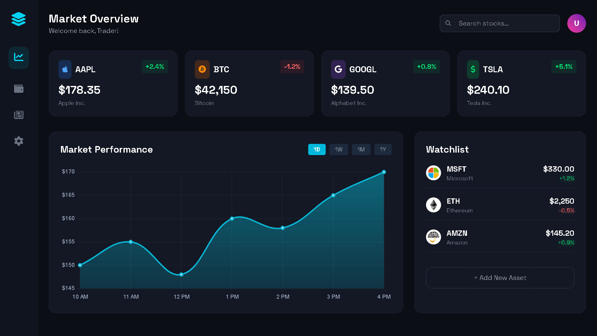
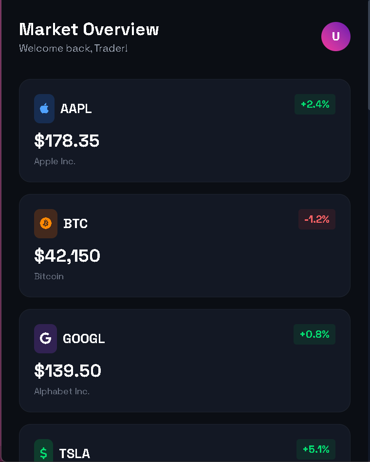

<div align="center">

  

  <a href="https://git.io/typing-svg">
    
  </a>

</div>

<br/>

<div align="center">

  
  
  
  

</div>

---

## 📊 Introduction

**TradeX** is a futuristic Stock Market Dashboard designed for traders who value aesthetics and speed. It leverages **Glassmorphism** design principles to create a sleek, dark-themed interface. The project integrates **Chart.js** to visualize market trends dynamically.

---

## ✨ Key Features

- 🎨 **Modern Glassmorphism UI:** Premium frosted glass effects with a dark aesthetic.
- 📈 **Interactive Charts:** Powered by **Chart.js** with gradient fills and smooth tension curves.
- 📱 **Fully Responsive:** Sidebar navigation that adapts to mobile and desktop layouts.
- ⚡ **Dynamic Indicators:** Visual cues (Green/Red) for stock price changes with neon glows.
- 📋 **Watchlist Integration:** Track your favorite assets like AAPL, BTC, and TSLA.

---

## 🛠️ Tech Stack

- **Frontend:** HTML5, Tailwind CSS
- **Scripting:** Vanilla JavaScript (ES6+)
- **Visualization:** Chart.js (Canvas API)
- **Icons:** FontAwesome 6
- **Fonts:** Space Grotesk & Outfit

---

## 📸 Screenshots

| Dashboard View | Mobile View |
|:---:|:---:|
|  |  |

---

## 🚀 How to Run

Since this is a static frontend project, no backend setup is required!

1. **Clone the repository:**
   ```bash
   git clone [https://github.com/your-username/tradex-tracker.git](https://github.com/your-username/tradex-tracker.git)

2. Navigate to the folder:
   ```Bash
    cd tradex-tracker

3. Launch:
   Simply open `index.html` in your browser or use Live Server in VS Code.

---

## 🤝 Contributing
Contributions are welcome! If you want to add API integration (e.g., CoinGecko or Alpha Vantage), feel free to fork and submit a PR.

📄 License
This project is licensed under the MIT License.

<div align="center">
Developed with 💻 & ☕ by <b> Atul Paul</b>
</div>
